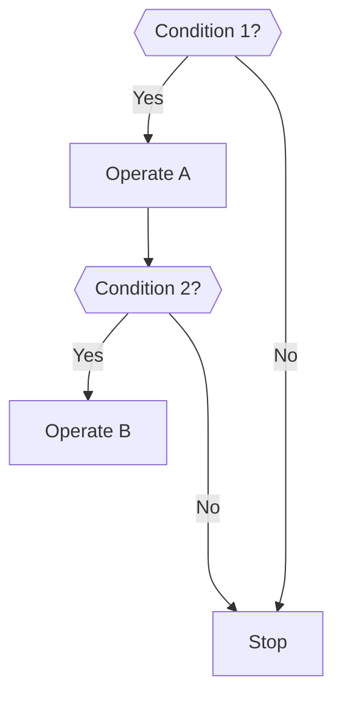
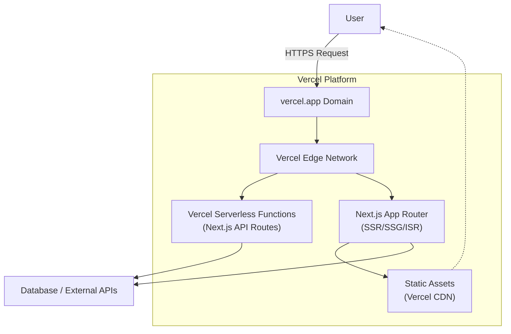

Mermaid syntax allows diagrams to be rendered directly in many documentation platforms, like GitHub, reducing the need for external tools.

I've found that storing a systems architecture diagram in a `README.MD` file using Mermaid syntax is really convenient because it keeps the diagram version-controlled and easily editable alongside the codebase and ensures that contributors always see the most up-to-date architecture when reviewing or updating the project.

This approach is particularly helpful in my day-to-day since I am typically deisgning and building the first release of a product and the architecture is fast-evolving.

These are some of the architecture diagrams I use most frequently in my `README.MD` files when making new websites or coded prototypes:

## Example

## Next.js on Vercel

